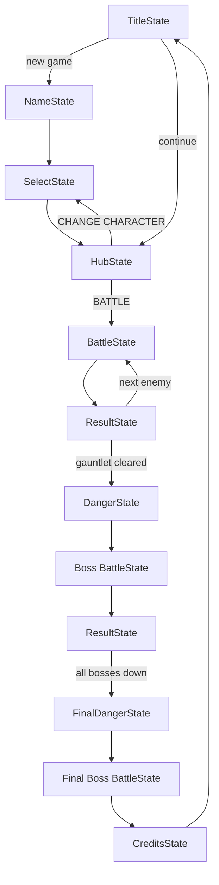

> 🇧🇷 [Português](architecture.pt-BR.md) · 🇬🇧 **English**

# Architecture

Guns and Boots is organized in five decoupled layers. The rule of thumb:
**states know about systems and entities; systems and entities never know
about states or rendering.**

```text
main.py
  └─ core/game.py (Game)
       ├─ core/state_manager.py (StateManager)  ── active screen
       │    └─ states/*  (TitleState, HubState, BattleState, ...)
       │         ├─ systems/*   (combat rules, enemy AI)
       │         ├─ entities/*  (Player, Enemy, Boss, FinalBoss, Projectile)
       │         └─ ui/*        (Button, HealthBar, LogBox, sprite loading)
       └─ audio (music per state + SFX)
```

## The `Game` object (`core/game.py`)

Owns everything with a process-wide lifetime:

- **Window and clock** — 640×360 desktop, 360×640 in `--mobile` mode, 60 FPS.
- **Main loop** — collects events, updates the active state, draws, flips.
- **Audio** — one music channel switched automatically on state change
  (`on_state_changed`): theme on title/credits, a random battle track in
  battles. SFX (`bullet.mp3`, `special.mp3`) are fire-and-forget.
- **Save file** — `save.json` at the runtime root. Stores player name,
  unlocked characters, defeated enemies/bosses/final bosses, round counter
  and the `completed` flag. All disk I/O is wrapped in
  try/except so a corrupted save never crashes the game — it just falls
  back to a fresh state.
- **Mobile input mapping** — in mobile mode, screen taps are translated to
  keyboard events before states see them (left third → ←, right third → →,
  center → Enter). States therefore only ever deal with keyboard input.

## State machine (`core/state_manager.py`)

Screens are stackable states with three operations:

| Operation | Effect | Typical use |
|---|---|---|
| `change(state)` | Replace the whole stack | Title → Hub |
| `push(state)` | Overlay a state, keep the previous alive | Hub → Battle |
| `pop()` | Return to the previous state | Battle result → Hub |

Every transition calls `game.on_state_changed(state)`, which is how the
soundtrack follows the player without any state having audio code.

### Screen flow



## Entities (`entities/`)

`Character` is the base class holding the combat-relevant state: HP, ATK,
DEF, weapon **heat**, **cover** flag, **medkits** and the special-attack
cooldown. `Player`, `Enemy`, `Boss` and `FinalBoss` extend it with sprites,
AI flags and (for the player) leveling and the one-time **boss form**
transformation used as a comeback mechanic in the final battle
(`activate_final_boss_form` / `revert_from_boss_form`).

`Projectile` animates the shot from attacker to target in real time
(~0.35 s) and only applies damage in its `on_hit` callback — so the log,
the health bar and the damage always land at the moment of visual impact.

## Systems (`systems/`)

Pure gameplay logic with **zero pygame imports**:

- `combat.py` — `resolve_action(attacker, defender, action)` executes one
  turn action and returns log lines. See [combat.md](combat.md) for all
  formulas.
- `ai.py` — `choose_action(enemy, player)` rule-based decision making,
  with a separate utility-scoring brain for the final boss.

Because these modules are headless, they power the terminal tools
(`tools/run_combat_debug.py`, `tools/run_test.py`) and can be unit-tested
without opening a window.

## Asset conventions

Characters are **discovered at runtime** from the file system — adding a
character requires no code change. See
[adding-characters.md](adding-characters.md).
