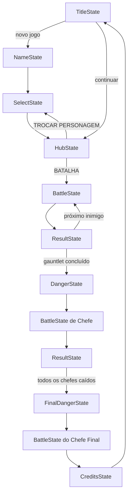

> 🇧🇷 **Português** · 🇬🇧 [English](architecture.md)

# Arquitetura

O Guns and Boots está organizado em cinco camadas desacopladas. A regra geral: **os estados conhecem os sistemas e as entidades; os sistemas e as entidades nunca conhecem os estados nem a renderização.**

```text
main.py
  └─ core/game.py (Game)
       ├─ core/state_manager.py (StateManager)  ── tela ativa
       │    └─ states/*  (TitleState, HubState, BattleState, ...)
       │         ├─ systems/*   (regras de combate, IA inimiga)
       │         ├─ entities/*  (Player, Enemy, Boss, FinalBoss, Projectile)
       │         └─ ui/*        (Button, HealthBar, LogBox, carga de sprites)
       └─ áudio (música por estado + efeitos sonoros)
```

## O objeto `Game` (`core/game.py`)

É dono de tudo que tem tempo de vida igual ao do processo:

- **Janela e clock** — 640×360 no desktop, 360×640 no modo `--mobile`, 60 FPS.
- **Loop principal** — coleta eventos, atualiza o estado ativo, desenha e faz o flip.
- **Áudio** — um canal de música trocado automaticamente na mudança de estado (`on_state_changed`): tema no título/créditos, faixa de batalha sorteada nas batalhas. Os efeitos sonoros (`bullet.mp3`, `special.mp3`) são disparados e esquecidos.
- **Arquivo de save** — `save.json` na raiz de execução. Guarda nome do jogador, personagens desbloqueados, inimigos/chefes/chefes finais derrotados, contador de rodadas e a flag `completed`. Toda E/S em disco é envolvida em try/except, então um save corrompido nunca derruba o jogo — ele apenas volta a um estado limpo.
- **Mapeamento de entrada mobile** — no modo mobile, toques na tela são traduzidos em eventos de teclado antes de chegarem aos estados (terço esquerdo → ←, terço direito → →, centro → Enter). Assim, os estados sempre lidam apenas com entrada de teclado.

## Máquina de estados (`core/state_manager.py`)

As telas são estados empilháveis com três operações:

| Operação | Efeito | Uso típico |
|---|---|---|
| `change(state)` | Substitui toda a pilha | Título → Hub |
| `push(state)` | Sobrepõe um estado, mantendo o anterior vivo | Hub → Batalha |
| `pop()` | Volta ao estado anterior | Resultado da batalha → Hub |

Toda transição chama `game.on_state_changed(state)`, e é assim que a trilha sonora acompanha o jogador sem que nenhum estado tenha código de áudio.

### Fluxo de telas



## Entidades (`entities/`)

`Character` é a classe base que guarda o estado relevante ao combate: HP, ATK, DEF, **calor** da arma, flag de **cobertura**, **medkits** e o cooldown do ataque especial. `Player`, `Enemy`, `Boss` e `FinalBoss` a estendem com sprites, flags de IA e (no caso do jogador) evolução de nível e a **forma de chefe** de uso único, usada como mecânica de virada na batalha final (`activate_final_boss_form` / `revert_from_boss_form`).

`Projectile` anima o tiro do atacante até o alvo em tempo real (~0,35 s) e só aplica dano no seu callback `on_hit` — assim, o log, a barra de vida e o dano sempre acontecem no momento do impacto visual.

## Sistemas (`systems/`)

Lógica de gameplay pura, com **zero imports de pygame**:

- `combat.py` — `resolve_action(attacker, defender, action)` executa uma ação de turno e devolve as linhas de log. Veja [combat.pt-BR.md](combat.pt-BR.md) para todas as fórmulas.
- `ai.py` — `choose_action(enemy, player)`, decisão baseada em regras, com um cérebro separado de pontuação por utilidade para o chefe final.

Como esses módulos não dependem de interface, eles alimentam as ferramentas de terminal (`tools/run_combat_debug.py`, `tools/run_test.py`) e podem ser testados sem abrir uma janela.

## Convenções de assets

Os personagens são **descobertos em tempo de execução** a partir do sistema de arquivos — adicionar um personagem não exige mudança de código. Veja [adding-characters.pt-BR.md](adding-characters.pt-BR.md).
